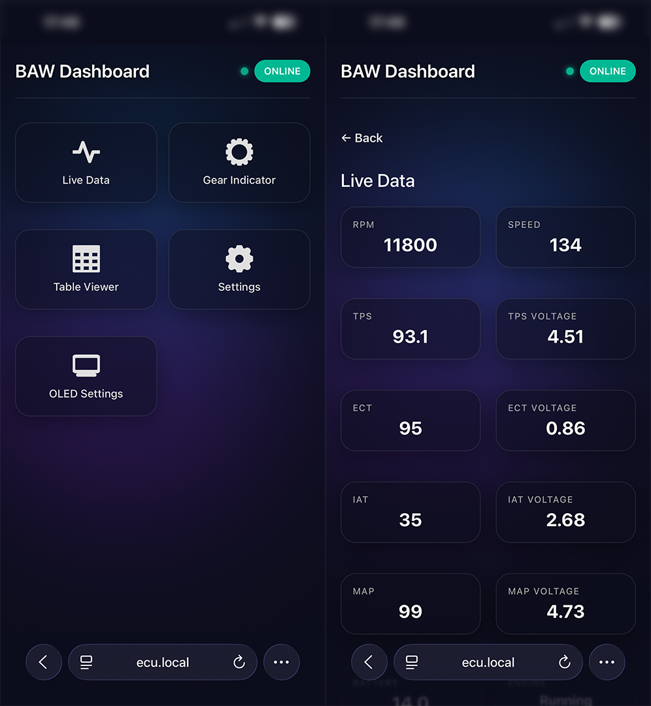
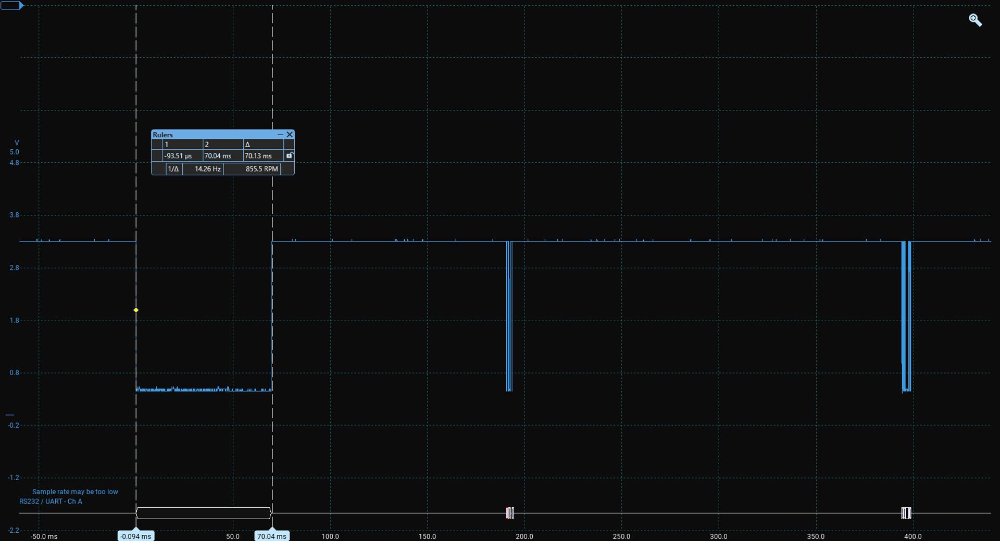
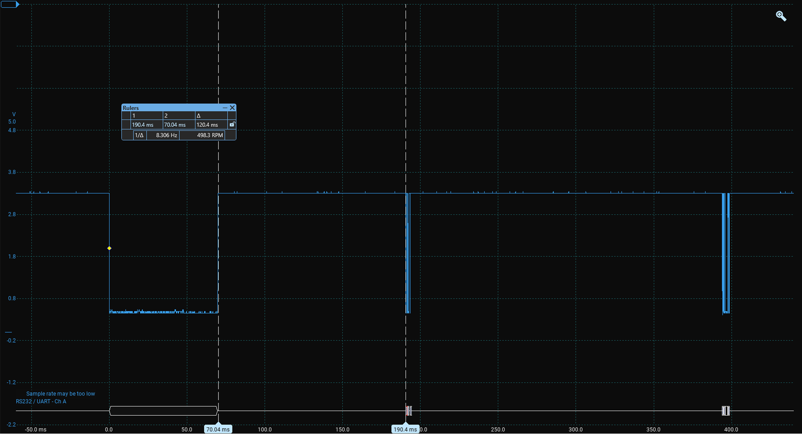
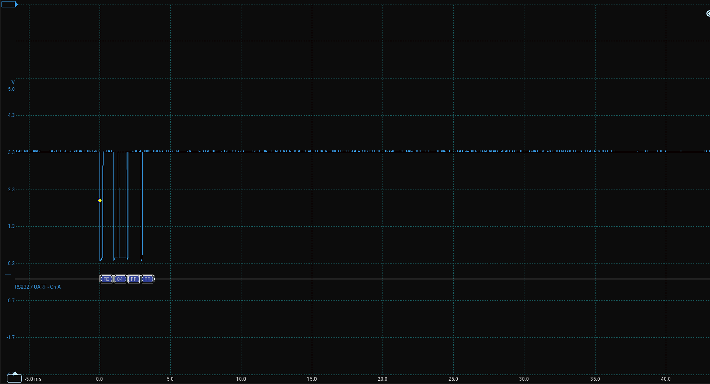
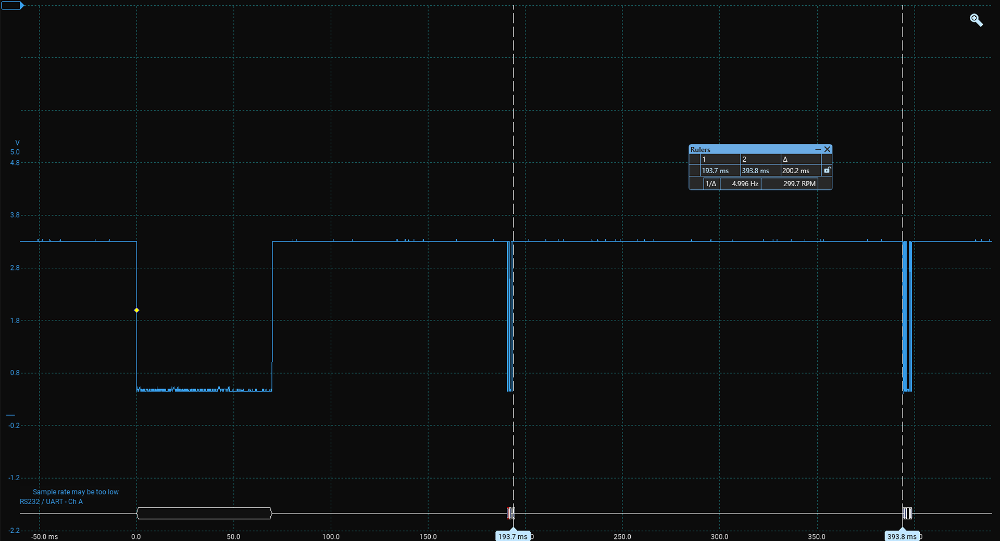
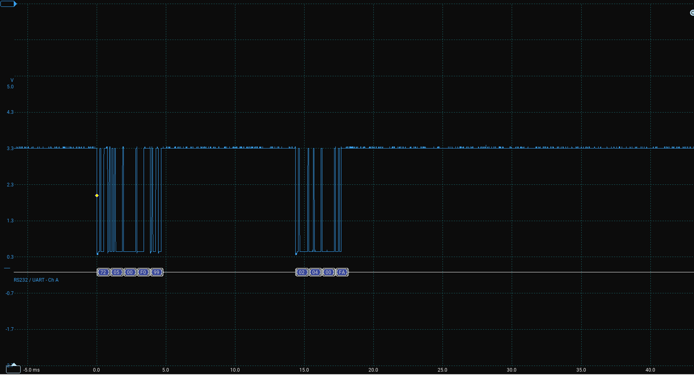

# Honda Motorcycle ECU Interface (K-Line / KWP2000)

 

 

  

 
 

> **DISCLAIMER:** Use at your own risk. Interfacing with vehicle ECUs involves electrical risks. The author is not responsible for any injury or damage to your motorcycle's ECU, electrical system, or mechanical components. Always ensure proper voltage levels (3.3V logic) when connecting to the ESP32.

## Overview
This project allows you to communicate with Honda motorcycle ECUs via the diagnostics port. It has a web interface and support for an OLED display to view real-time data from the ECU.

### What can it do?
*   **Web Interface:** View live data from the ECU in a responsive web app.
*   **Configurable Polling:** Adjust how often the ESP requests data from the ECU.
*   **OLED Support:** Display Gear, RPM, or other parameters on a physical screen (works offline without WiFi).
*   **Wifi Management:** Settings can be changed via the webapp hosted on the ESP32.

---

## Hardware Used
*   **MCU:** ESP32-S3-Zero
*   **Power:** Buck converter (Input: 6V-32V → Output: 5V)
*   **Display:** 1.09in OLED (128x64px) via I2C
*   **K-Line Interface:** L9637D Transceiver
    *   1x 510Ω Pull-up Resistor
    *   1x 100nF Capacitor

---

## How to access
1.  **Configure:** Write your Hotspot SSID and Password inside `Config.h`.
2.  **Flash:** Upload the firmware and Filesystem image via PlatformIO.
3.  **Connect:** Connect the interface to the diagnostics port. Ensure the ignition is **ON** (ECU must be powered). 
4.  **Hotspot:** Turn on your Hotspot so that the ESP can connect to it. 
5.  **Access:** Open the browser and go to `http://ecu.local`.

---

## Technical Details & Protocol
**Tested on:** '05 Honda CBR600RR.

The documentation regarding Honda's specific K-Line implementation is kind of scarce. Honda engineers seem to vary the implementation of the **KWP2000 protocol**  between models.

### Communication Basics
The communication is of the type **Master-Slave**:
*   **Master:** ESP32 (Diagnostics Tool)
*   **Slave:** ECU

To start communication, a very specific **Initialization Sequence** is required. This sequence varies by model year. For this project, it goes like this:

1.  **Idle:** K-Line idles high (12V).
2.  **Pull Low:** Pull K-Line low for **70ms**.

  

 
 

3.  **Wait:** Let it idle high for **120ms**.

  

 
 

4.  **Send Wakeup:** Send message `0xFE 0x04 0xFF 0xFF` (No response expected).

  

 
 

5.  **Wait:** Wait for **200ms**.

  

 
 

6.  **Send Init message:** Send `0x72 0x05 0x00 0xF0 0x99`.

  

 
 

7.  **Response:** ECU should reply with `0x02 0x04 0x00 0xFA`.

 
 

>**Note:** The connection requires a "Keep-Alive" message every 2-3 seconds, or the ECU will drop the session. Any valid request acts as a keep-alive.

---

## Network Traffic Example

Below are some example frames for the KWP2000 communication used in this project.

### 1. Status & Gear Request (Table 0xD1)

 

**Transmitted (Request):**
`72 05 71 D1 47`

| Byte | Value | Description |
| :--- | :--- | :--- |
| 0 | `0x72` | Destination Address (ECU) |
| 1 | `0x05` | Total Packet Length |
| 2 | `0x71` | Request Type (Read The Entire Table From Memory) |
| 3 | `0xD1` | The ID of the table you want |
| 4 | `0x47` | Checksum |

 

**Received (Response):**
`02 0A 71 D1 00 00 00 00 01 22`

| Byte | Value | Description | Meaning |
| :--- | :--- | :--- | :--- |
| 0 |  `xx02` | Destination Address (In this case the ESP)|
| 1 |  `x0A` | Total Packet Length |
| 2 |  `x71` | Means this response is for a Request Type: Read The Entire Table From Memory |
| 3 | `0xD1` | Requested table ID |
| 4 | `0x00` | **Gear Status** | `x01` = Neutral/Clutch, `x00` = In Gear, `x03` = On kickstand |
| 5 | `x00` | *Unknown* |
| 6 | `x00` | *Unknown* |
| 7 | `x00` | *Unknown* |
| 8 | `0x01` | **Engine Status** | `x01` = Running, `x01` = Running |
| 9 | `0x22` | Checksum |

 

---

### 2. Sensor Data Request (Table 0x10)
 

**Transmitted (Request):**
`72 05 71 10 08`

| Byte | Value | Description |
| :--- | :--- | :--- |
| 0 | `0x72` | Destination Address (ECU) |
| 1 | `0x05` | Total Packet Length |
| 2 | `0x71` | Request Type (Read The Entire Table From Memory) |
| 3 | `0x10` | The ID of the table you want |
| 4 | `0x08` | Checksum |

 

**Received (Response):**
`02 16 71 10 2A 30 D4 87 2C 87 9F 3C E0 5D FF FF 8E 7A 12 0A 80 52`

| Offset | Value | Description | 
| :--- | :--- | :--- |
| 0 | `0x02` | Destination Address (In this case the ESP) |
| 1 | `0x16` | Length (22) |
| 2 | `0x71` | HRequest Type (Read The Entire Table From Memory) |
| 3 | `0x10` | Table ID |
| 4-5 | `0x2A 0x30` | **RPM** (High/Low Bytes) |
| 6 | `0xD4` | **TPS Voltage** |
| 7 | `0x87` | **TPS %**  |
| 8 | `0x2C` | **ECT Voltage** |
| 9 | `0x87` | **ECT degC** |
| 10 | `0x9F` | **IAT Voltage** |
| 11 | `0x3C` | **IAT degC** |
| 12 | `0xE0` | **MAP Voltage** |
| 13 | `0x5D` | **MAP kPa** |
| 14 | `0xFF` | *Unknown* |
| 15 | `0xFF` | *Unknown* |
| 16 | `0x8E` | **Battery Voltage** |
| 17 | `0x7A` | **Speed km/h** |
| 18 | `0x12` | *Unknown* but possibly fuel related |
| 19 | `0x0A` | *Unknown* but possibly fuel related |
| 20 | `0x80` | *Unknown* |
| 21 | `0x52` | Checksum |

 

---

## This project utilizes the following open-source libraries and assets:

*   **Bootstrap Icons** (Used in Web Interface)
    *   License: MIT
    *   Copyright (c) 2019-2024 The Bootstrap Authors
    *   [Source](https://icons.getbootstrap.com/)

 

---

## Other Resources
* https://gonzos.net/projects/ctx-obd/  | Thanks to this guy for his work.